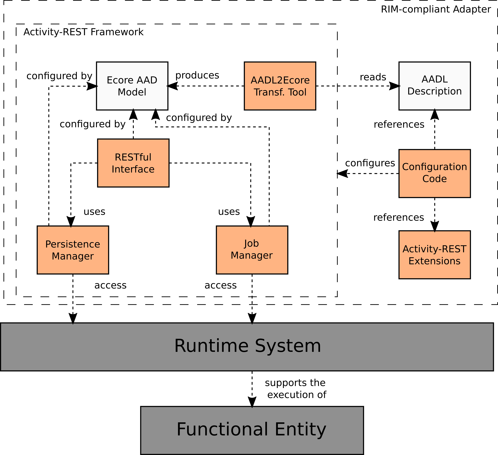

## Architecture of an Activity-REST service

The following figure presents the main components of an Activity-REST RIM-compliant adapter service.
The `RIM-compliant adapter` includes the `Activity-REST framework` as one of the main dependencies, and executes on a `Runtime System` (OS and an application container) that supports the execution of the `Functional Entity` (an underlying command line analysis tool).





## Creating a new RIM-compliant adapter service


### Project file organization

After the creation of the adapter project using the provided Maven archetype, a folder containing the project base source code is created. 
This folder presents the following overall organization:

```filesystem
<project_root>
  | - src/${MY_GROUP_ID}
  |     | - ApplicationConfig.java // Configuration Code Component 
  |     | - activity.aadl          // the activity description
  |     | - activityrest.properties // Configuration Code Component
  | 	| - <other Java classes for Activity-REST Extension 
  |     |   component may be created here, i.e., classes for extenal 
  |     |   contraint validators>
  |
  | - tests/
  |     | - <Unit tests can be created here>
  |
  | - WebContent/
  |     | - <JAX-RS folder for static files (currently empty)>
  |
  | - target/
  |     | - <Will contain the compiled project WAR>
  |
  | - pom.xml // Maven dependencies and build configuration for project
```

### Configuration Code component

The configuration code component initializes the Activity-REST framework.
The main unit of this component is the class `ApplicationConfig.java`.
`ApplicationConig.java` defines a JAX-RS service application, creates an `ActivityRestConfig`instance on its constructor and then uses it to initialize the Activity-REST framework.

The minimal `ApplicationConfig`class is presented in the next code block.
This class needs to be changed only if the framework is extended by new constraint validators and/or endpoints.

`ApplicationConfig.java`

```java
package br.usp.ffclrp.dcm.lssb.geas.deseq2analsyis;

import java.io.File;
import java.io.IOException;
import java.util.HashMap;
import java.util.Map;
import java.util.Properties;
import java.util.Set;
import javax.ws.rs.ApplicationPath;
import br.usp.ffclrp.dcm.lssb.activityrest.dao.FileSystemActivityRepository;
import br.usp.ffclrp.dcm.lssb.activityrest.rest.ActivityRestConfig;
import br.usp.ffclrp.dcm.lssb.activityrest.rest.BasicApplicationJAXRSConfig;
import br.usp.ffclrp.dcm.lssb.activityrest.util.ModelsService;
import br.usp.ffclrp.dcm.lssb.restaurant.analysisactivitydescription.Activity;

@ApplicationPath("/")
public class ApplicationConfig extends BasicApplicationJAXRSConfig {
	
	final String ACTIVITYREST_PROPERTIES = "activityrest.properties";
	static final String ACTIVITY_DESCRIPTION = "activity.aadl";

	ActivityRestConfig config;
	
	public ApplicationConfig() {
		super();

		this.config = new ActivityRestConfig();
		try {
			Activity activityModel = ModelsService.retrieveAADLModel(
					this.getClass().getResourceAsStream(
							ACTIVITY_DESCRIPTION));
			
			this.config.setActivityModel(activityModel);
			Properties deploymentProperties = new Properties();
			deploymentProperties.load(
					this.getClass().getResourceAsStream(ACTIVITYREST_PROPERTIES));
			
			File nonExecutedActivityStorage = new File(deploymentProperties.getProperty("activityrest.repositories.nonExecuted"));
			this.config.setNewAnalysisRepository(
					new FileSystemActivityRepository(nonExecutedActivityStorage, activityModel));
			
			File runningActivityStorage = new File(deploymentProperties.getProperty("activityrest.repositories.running"));
			this.config.setRunningAnalysisRepository(
					new FileSystemActivityRepository(runningActivityStorage, activityModel));
			
			File failedActivityStorage = new File(deploymentProperties.getProperty("activityrest.repositories.failed"));
			this.config.setFailedAnalysisRepository(
					new FileSystemActivityRepository(failedActivityStorage, activityModel));
			
			File succeededActivityStorage = new File(deploymentProperties.getProperty("activityrest.repositories.succeeded"));
			this.config.setSuccededAnalysisRepository(
					new FileSystemActivityRepository(succeededActivityStorage, activityModel));
			
		} catch (IOException e) {
			// TODO Auto-generated catch block
			e.printStackTrace();
		}
	}
	
	@Override
	public Set<Class<?>> getClasses() {
		Set<Class<?>> resources = super.getClasses();
		
		// add here all classes with JAX-RS annotations
		
		return resources;
	}
	
	@Override
	public Map<String, Object> getProperties() {
		Map<String, Object> map = new HashMap<String, Object>();
		map.put("activityrest.config", this.config);
		return map;
	}
	
}

```

The Configuration Code component passes the `ActivityRestConfig` object to the Activity-REST framework through the map created in the `getProperties()` method (map key `activityrest.config`.

The previous code refers to two other files of the project.
The `activityrest.properties` file contains information that may change in different deployiments of the service.
Here you may change the folders where the activity repositories (part of the `Persistence Manager` component) will persist the analysis activity instances created by the user.
DO NOT use the same folder for two different repositories.
A example configuration is presented in the next code block:

`activityrest.properties`:
```properties
activityrest.repositories.nonExecuted = /tmp/deseq2-analysis/new-analyses
activityrest.repositories.succeeded = /tmp/deseq2-analysis/succeeded-analyses
activityrest.repositories.failed = /tmp/deseq2-analysis/failed-analyses
activityrest.repositories.running = /tmp/deseq2-analysis/running-analyses
```


## Activity-REST Extensions component

New constraint validators and endpoints may be added to a Activity-REST service through the creation of dedicated Java classes.
These classes must also be referenced by the `Configuration Code` component in order to be accessible by the framework.
Note that this feature is still in an *unstable state* and may have slight changes in future. 

In order to create a new external constraint validator, the developer must implement one of the constraint validation interfaces: `ParameterValidator` and `InputDatasetValidator`. 
Both interfaces provide a single method `validate()` that must be implemented in order to validate new parameter values or the submitted file for a input dataset and return an instance of the class `ValidationResult`.
These methods will be called by the Activity-REST framework when a service user submits new parameter values and new files for the input datasets. 

**Note: Constraint validators MUST NOT change the values received.**

`ParameterValidator::validate()` receives the name of the parameter the constraint is applied to (the parameter recently changed), a `ParameterMap` instance containing the new values for all the parameters of the analysis activity instance and a reference for the `AnalysisActivity` instance.

```java
package br.usp.ffclrp.dcm.lssb.activityrest.domain.validation;

import br.usp.ffclrp.dcm.lssb.activityrest.domain.AnalysisActivity;

public interface ParameterValidator {
	
	 public ValidationResult validate(
			 String parameterName, 
			 ParameterMap newValues, 
			 AnalysisActivity activityInstance);
	
}
```

Usually a parameter validator will use the received parameter name to fined the parameter new value in the received map in order to validate this value.
The `AnalysisActvity` instance can also be read in order to implement validations that depends on the files of the input datasets.

`InputDatasetValidator::validate()` receives the changed (input) dataset and the `AnalysisActivity` instance.
Usually, an input dataset validator will check the contents of the files in the input dataset and validate them.
However, the instance of `AnalysisActivity` can be also read in order to implement constraint validations that also depends of the current value of execution parameter and other input datasets.

```java
package br.usp.ffclrp.dcm.lssb.activityrest.domain.validation;

import java.io.File;
import br.usp.ffclrp.dcm.lssb.activityrest.domain.AnalysisActivity;
import br.usp.ffclrp.dcm.lssb.restaurant.analysisactivitydescription.Dataset;

public interface InputDatasetValidator {
	
	public ValidationResult validate(
			Dataset dataset,
			AnalysisActivity activityInstance);
	
}
```

The new validation classes must be instantiated and the derived instances must be referenced by the `Configuration Code` component using the external constraint identifier presented in the activity's AADL description.

For example, let's create an email validator for an execution parameter and a maximum file size validator for an input dataset.
First, we define the constraint identifiers in the `activity.aadl` file:


```aadl
activity my-analysis {
	on {
		dataset samples : 'text/tsv' [1,-1] {
			constraints ['maxFileSize'];
		};
		// other datasets...
	}
	with {
		parameter email : STRING [1,1]{
			contraints ['isEmail'];	
		};
		// other parameters
	}
	produces {
		// output dataset declarations
	}
	using executable // tool description  ...
}

```

Then, we implement `ParameterValidator` and `InputDatasetValidator` with the validation code.
For the email validation, we will wrap an existing [Apache Commons validator](http://commons.apache.org/proper/commons-validator/apidocs/org/apache/commons/validator/routines/EmailValidator.html) (This is not a default Java package and the [Apache Commons Validator](https://commons.apache.org/proper/commons-validator/) bundle must be included as dependency in the `pom.xml` file).


`EmailValidator.java`:
```java
import org.apache.commons.validator.routines.EmailValidator;

public class EmailValidator implements ParameterValidator {

	 public ValidationResult validate(
			 String parameterName, 
			 ParameterMap newValues, 
			 AnalysisActivity activityInstance){

		// get values
		List<Object> values = 
			(List<Object>) newValues.get(parameterName);
		
		// validate all the elements of the list
		for(Object value : values){
			boolean valid = 
				EmailValidator.getInstance()
				 .isValid(value.toString());
			if(!valid) {
				return new ValidationResult(false,
					"Bad email");
			}
		}

		// return valid if arrived here
		return new ValidationResult(true,null);

	}
}
```

For the file size validation, we can use the `File::length()`method of the Java API:

`MaximumFileSizeValidator.java`:
```java
public class MaximumFileSizeValidator implements InputDatasetValidator {

	final long MAX_SIZE = 1_000_000; // 1MB

	public ValidationResult validate(
			Dataset dataset,
			AnalysisActivity activityInstance){
		for(File f : dataset.getFiles()) {
			// validate each file
			if(f.length() > MAX_SIZE) {
				return new ValidationResult(false,
					"File too big!"
					+ "Maximum: " 
					+ MAX_SIZE + 
					" bytes!");
			}
		}

		// return valid if arrived here
		return new ValidationResult(true,null);

	}
	
}

```

Finally, we instantiate both classes and includes then in the `ActivityRestConfig` object created in the `Configuration Code` component. 

```java
@ApplicationPath("/")
public class ApplicationConfig extends BasicApplicationJAXRSConfig {
	
	final String ACTIVITYREST_PROPERTIES = "activityrest.properties";
	static final String ACTIVITY_DESCRIPTION = "activity.aadl";

	ActivityRestConfig config;
	
	public ApplicationConfig() {
		super();

		this.config = new ActivityRestConfig();
		try {
			// ... 
			Map<String,ParameterValidator> parameterConstraints
				= new Map<>();

			parameterConstraint.put("isEmail", new EmailValidator());
			// other constraints ....
			this.config.setParameterConstraints(parameterConstraints);


			Map<String,InputDatasetValidator> datasetConstraints
				= new Map<>();
			datasetConstraints.put("maxFileSize", new FileSizeValidator());
			// other constraints ....
			this.config.setInputDatasetConstraints(datasetConstraints);
			// ...

		} catch (IOException e) {
			// TODO Auto-generated catch block
			e.printStackTrace();
		}
	}

	// ...
}
```


